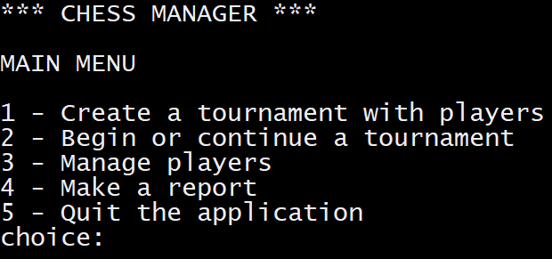

# Chess manager v1
**_Projet réalisé lors de ma formation de Développeur d'application Python à OpenClassrooms_**

 

This application is a chess tournament manager.

Create your tournament, add the players and the application will automatically display the games of the round to play.
After you write the results, the application will show the ranking of the players.
The application data are saved in a local file database.json in directory database (not to be deleted).
It uses tinydb.

## Installation
Assumption: at least python 3.9.1 already installed.

Dowload the package of the application from github, unzip and store it in a new directory.

Open a new windows 10 terminal with the cmd command in this directory.

Create the virtual environnement: >python -m venv env

Activate the virtual environnement: >env\Scripts\activate.bat

Install the lastest version of pip: >python -m pip install --upgrade pip

Instal the required python packages: >pip install -r requirements.txt

## How to run the pyton script
Run the python script: >py main.py

##Flake 8 report
Type: >flake8

You will find the report in directory flake-report.

